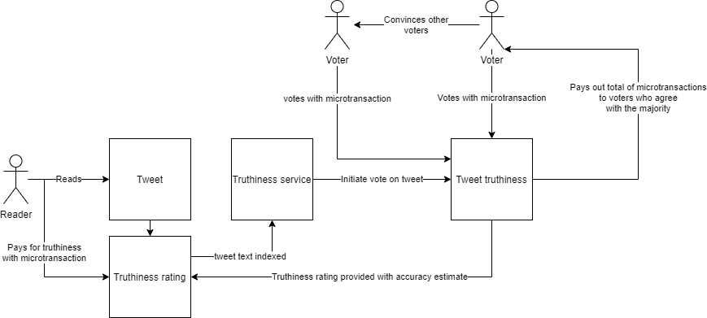

# crowd-sourced-truthiness
A concept of how truthiness can be crowd sourced with an incentive mechanism for contributors to be correct

[(link to above diagram)](https://app.diagrams.net/?lightbox=1&highlight=0000ff&edit=_blank&nav=1&title=crowd-sourced-truthiness.drawio#R5Vptb6M4EP41fNwKzEuSj03avV3pTqq2q7vup5MLE%2FAeYGRMXvbXnw0mBDvk0m1S0r0oUuxhbOyZZ54ZQyx3kW1%2BY7hI%2FqARpBayo43l3lkIOR5Clvza0baRTKZeI4gZiZRSJ3gkP0AJbSWtSARlT5FTmnJS9IUhzXMIeU%2BGGaPrvtqSpv27FjgGQ%2FAY4tSU%2FkUinjTSqW938k9A4qS9s2OrKxlulZWgTHBE13si995yF4xS3rSyzQJSabzWLs24jwNXdwtjkPNTBnh%2Fr75sPn0t0HT%2B8Pkp%2BrZGUfXBcZtpVjit1I75GoBLM8NG%2FpA8gg1Eag982xoGImEn1aWMJzSmOU7vO%2Bmc0UqMlXe3Ra%2FT%2BZ3SQggdIfwOnG%2BV03HFqRAlPEvVVdgQ%2FrTX%2FianukG%2B6t5t1NR1Z6s6zULl6gbtpEQlrVgIR4yjkMoxi4EfMyLauVPEAdAMONuKgQxSzMmqvxCsABnv9DqfiYZy2wtciEwXjuGsM9rdOdHu3phmdwyrf20CRzP9OiEcHgtc73gtSLJvNlwWDW0tiYyy1o4rYCL%2BjlvS3Hk7IFCUozgXeaq%2F7hhsx1PJPnu1wvNbyzfM9TknnGAOUkrrH5pLrx%2B04jsDMDqVOcaFMDIxzCqekBzKUu4T2IqIjV4BpF3n6iDd5vUh6zHhwTyWu2R0RSQ05WrFYsVawrBiOJT7g5KTrI6CEfJrLuzwtN9pMqzfdrsMW%2FfaFNvmZaWpMrPzVmnZOTUvvza41NAHSnLeQTFw%2B1D0kIawZl1qlAay3TJegTszah%2FwViKOVnXdRjmWk9ClrEJJyChnOC9xyAnNhVqQCpvNn5loxbIlUNEwMJNzrBPZxTEDMFUVfHkCdYH7nTLCt%2B%2Bdq0%2Bu8iZHGcq%2BsR00aeZ6JcImev6enYawW8bwdk%2BtkArl8H2mOqnOtBPEf%2Bg7bk9fNJoVaKPb5dDlsoSLhETrQ7MYs%2FkeJY%2Bfxvzp1aUx8%2FTwBXBkWut9RfXJBdio9ZdZQSgmX1KmYXeAinV%2BH7WMsF9WRozg7rNUBC%2Bm2ReyrFZeOEdI9mw1xUESAGbAqUxwIZtVlt6GXKDUnUtCJKHAC36G9IGWpMahe%2FdMOaeZUEjlhTkO%2F4lrqC1oKseJ2dxl%2Fdmb4zYlsRzLqUbGorRJRSQsdk%2F57PMQslbLocDkY%2FcAHQeXYuMDiezQmWL8TKY%2FY3APWO6tnzFMDeP9Kcrasjt3XQNbnpH1nMmpWW6A97rSdWbPrFeVrpcv8tDMcK%2BggxXJw9rFVJxKmJkn24PNL%2BDos59kPS2GjdC88Em2xa8WsL9%2B1gnax6HtS7GRsw4KDEeMETFDhSQ6XyV5%2BSeyA6HmaaHma75sOMAINWMi3%2B5DZ%2Fei9MzPBvQFo8DXYHaJMtQkhNVPZPCaE7QSSIV4KAAB7EDsZySKGhRDSX7g53o%2BiS1lKDG5P7f8u2MEoN5Bq8HW7s3vPg6PxN8gXXywb4Jp4Pb80b5%2FuuJ8bday%2Fw9299Bbsbvodv8faPzW%2FQvDvf8X)

1. "Truthiness" : the degree to which a statement is true. Applies to social media posts in that the truthiness may be difficult to discern. A truthiness score can then be a factor in assisting the consumer of what is indeed truthful.
2. Truthiness is hard to determine in many cases, especially when statements are not directly observable. Ex. "Climate change is an existential threat". This is additionally compounded by divided opinion, despite the measurable evidence.
3. Truthiness may be difficult to determine with artificial intelligence or through automation. To do so would require new techniques and AI algorithms not yet available.
4. Crowd sourcing a truthiness rating may be a viable alternative but would likely be hampered by contributors who have motivations not necessarily aligned to obtaining the real truth.
